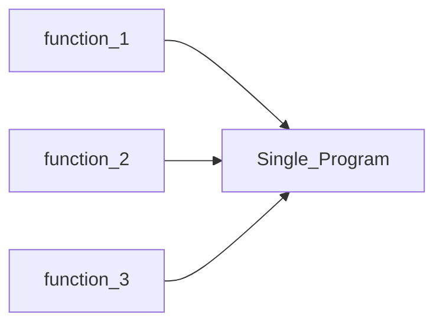

---
{"dg-publish":true,"permalink":"/03-coding/02-c/c-for-students/","tags":["#ai_robot","for_students"],"created":"2025-06-01T04:19:58.756+05:30","updated":"2025-06-01T05:37:27.109+05:30"}
---

# C++ For Students

>[!Note]- **Before**
>Before reading this there are something to rememeber
>1. Notes are entirely made usng [[06 OS/Tools/Tools/Obsidian/Obsidian\|Obsidian]] and if you want to execute codes on the go you can just install the Obsidian app from [here](https://obsidian.md/download) and the extension [Excecute code](https://github.com/twibiral/obsidian-execute-code). 
>2. Each Code snippet  marked `#completeCode`   will run independently ie, you can just copy paste the code and it will just run. 
>3. There are expandable callouts which will have a `>` symbol after their tilte like this one and they can be extended, to see the full content 
>4. Output of a programm will be inside a collapsed callout 
>5. Feel free to correct the error and send a pr to [this](https://github.com/aruncs31s/Notes) repo 


# TODO 
```tasks
not done 
path includes C++ for Students
```
$$

$$
- [ ] What
# Basics

- First program
- Printing 
- Variables 
- Data types 
- Operations 
- Custom Datatypes 

##  Introduction 
Basics of all programming languages are almost the same , so if you have already know another programming language just skip this part.


>[!todo]- **Programmer Note **
>1. Compatible OS[^1]  Environment  
>	- **windows** should be fine but i highly recommend using **wsl** on windows. 
>	- **Linux** ,i use linux , windows and macos , and i find linux is good for programming, but and when you do advanced stuffs. It easy to install linux in virtual machine or
>		- Dual boot 
>		- WSL 
>		- Cloud  -> Github Codespace etc.
>2. Editor , i personally use **vim** , **neovim** , **vscode** for coding. But when im just learning something i always tends to use **neovim** because it is light weight and feels good to use. 
>3. Compiler , **linux** comes pre installed with **[clang](https://clang.llvm.org/)** 


 [^1]: OS means operating system, which is the programs that allows you to interract with your computer 

## First Program 
When someone try to learn programming language the first thing they write is a **Hello World** program -> more about it [here](https://press.rebus.community/programmingfundamentals/chapter/hello-world/#:~:text=A%20%E2%80%9CHello%2C%20world!%E2%80%9D,very%20first%20program%20people%20write.) 

#completeCode 1
```cpp
#include <iostream>  
using namespace std;  
  
int main() {  
  cout << "Hello World!";  
  return 0;  
}
```
**How to execute it?**
- Open any editor 
- type/copy what is in the snippet[^2] and paste it in the editor 
- Save it in a file or create a new file for it and give **.cpp** extension 
- use [GCC](https://gcc.gnu.org/) or any other compiler to compile it. 
>```bash
> g++ <your_program_name> -o <output_file_name>
>```
- Run the program using the command
>```bash
>./<output_file_name>
>``` 
- You can use a ide to automate this process if you dont want to deal with the terminal 

> [!Note]-  **For Windows CMD**
>
> for windows user `./<output_file_name>` will not work , instead use `.\<output_file_name>` to run the program.

[^2]: Block of code 
- After executing you will get the following output 

```
Hello World!
```


### Explenation 

```cpp
#include <iostream>  
```
- `#include <iostream>` is a preprocessor directive that tells the compiler to include the standard input-output stream library, which is necessary for using `cout` and `cin`. (it is same as #include <stdio.h> in C)

```cpp
using namespace std;  
```

- `using namespace std` means that we can use names for objects and variables from the standard library.
  - if you dont include the `using namespace std` you will be doing `std::cout` instead of just typing `cout`  
For example 
#completeCode 2
```cpp
#include <iostream>
using namespace std;
int main(){
  cout << "Some String\n"; // Prints "Some String"
}
```

if `using namespace std` is not included the above program will become

#completeCode 3 
```cpp
#include <iostream>
int main(){
std::cout << "Some String\n"; // Prints "Some String"
}
```


### Executing your first program

```bash
g++ program_name.cpp -o bin_file_name
./bin_file_name
```


*I have used [Vim](https://www.vim.org/) as the text editor , which is the default editor for linux and [g++](https://www.geeksforgeeks.org/compiling-with-g-plus-plus/) for compiling*

## Printing
*Displaying something on the terminal.*

#completeCode 4
```cpp
#include <iostream>  
using namespace std;  
int main() {  
  cout << "Hello World!" << endl;  
  return 0;  
}
```

### Escape characters 
Complete list of escape characters can be found [here](https://www.geeksforgeeks.org/cpp-escape-sequences/)
#### New Line 
```cpp
#include <iostream>  
using namespace std;  
  
int main() {  
  cout << "Hello \n World!";  
  return 0;  
}
```

```
Hello 
World!
```


### Comments
*Comments will be excluded by the compiler.*
```cpp
// This is a comment in c++
```
```cpp
/* 
This is a multi-line comment in c++
*/
```

## Variables
a variable is a **named storage** location in the computer's memory that holds a value.

#example 
```cpp
int a = 10;
double b = 10.10;
char letter = 'A';
const char* some_string = "Hello World";
std::string some_another_string = "Hello, world";
bool something = false; 
```


a variable in the sense that their value can be changed during the execution of the program. 

#snippet 
```cpp
int x = 10;
x = 20; // x is now 20
x = 30; // x is now 30

```

>[!Note] `string`
>When using `std::string`  the **string** lib should be included. 
>```cpp
>#include \<string>
>```


```cpp
// valid 
int a =10 , b=20 , c 30 ;
// invalid
int a,b,c = 10,20,30 ;
// valid 
int a = 10; 
// valid 
int a ;
a = 10 ; 
```

### Constants 
*also called **literals*** eg: string literals 
```cpp 
const int number = 10 ;
// Error 
number = 20;
```

- the value of the constant can't be changed after the first assingment , and it is initialized the moment it is created. 


## Datatypes 

1. Builtin Data types(Primitive Datatypes)
2. Derived Datatypes 
3. User Defined Datatypes 

### Primitive Data Types 
```cpp
// Integer types 
int x = 500; // 4 bytes 
short x = 100; // 2 bytes 
long x = 1000000L ; // 4 bytes or 8 bytes 
long long x = 10000000000LL; // 8 bytes 
unsigned int x = 10;
// Floating Point 
float x = 1.2 ; // 4 bytes 
double x = 1.2312; // 8 bytes 
long double = 1.23131233434343; // 16 bytes 

// Charaters 
char x = "X" ;
wchar_t x = L"😅";

// Boolean  (0 -> false , 1 -> true)
bool isComplete = true ;
bool isComplete = 1 ;
```

--- 
##### Size of Datatypes 
```cpp
#include <iostream>
using namespace std;
void print_size(int x){
    cout << x <<  " bytes ; " << x*8 << "bits" << endl;
}
int main(){
    cout << "Integers" << endl ;
    cout << "----------" << endl; 
    print_size(sizeof(int)) ; 
    print_size(sizeof(short)) ; 
    print_size(sizeof(long)); 
    print_size(sizeof(long long)) ;
    cout << "----------" << endl; 
    cout << "floating point" << endl ;
    cout << "----------" << endl; 
    print_size(sizeof(float)) ; 
    print_size(sizeof(double)) ; 
    print_size(sizeof(long double)) ; 
    cout << "----------" << endl; 
    cout << "Character" << endl; 
    cout << "----------" << endl; 
    print_size(sizeof(char)) ;
    print_size(sizeof(wchar_t)) ; 
}
```


>[!success]- **Output**
>```
>Integers
>----------
>4 bytes ; 32bits
>2 bytes ; 16bits
>8 bytes ; 64bits
>8 bytes ; 64bits
>----------
>floating point
>----------
>4 bytes ; 32bits
>8 bytes ; 64bits
>16 bytes ; 128bits
>----------
>Character
>----------
>1 bytes ; 8bits
>4 bytes ; 32bits
>```


- size of `bool` is 1 bit 


### Derived Datatypes
1. Arrays
2. Pointers 
3. References


#### Arrays

```cpp
int a[] = {1, 2, 3};               
int b[3] = {1, 2, 3};
char c[] = "abc";
char d[] = {'a', 'b', 'c'}; 
char e[3] = {'a', 'b', 'c'};
```

#example 

 ```cpp

#include <iostream>
#include <array>
using namespace std;

template <typename T, size_t N>
void print_arr(const T (&arr)[N]) {
    for(size_t i = 0; i < N; i++) {
        cout << arr[i] << " ";
    }
    cout << endl;
}

int main() {
    int a[] = {1, 2, 3};               
    int b[3] = {1, 2, 3};
    char c[] = "abc";
    char d[] = {'a', 'b', 'c'}; 
    char e[3] = {'a', 'b', 'c'};
    print_arr(a);   
    print_arr(b);
    print_arr(c);
    print_arr(d);
    print_arr(e);
    return 0;
}
 
```

>[!success]- **Output**
>```
>1 2 3 
>1 2 3 
>a b c  
>a b c 
>a b c
>```


### Pointers
A more notes of pointer can be found here -> [[03 Coding/01 C/Pointers\|Pointers]]

```cpp
type* pointer_name;
```

#examples 
```cpp
#include <iostream>
using namespace std;

int main() {
    int x = 5;
    int* ptr = &x; 
    cout << "Value of x: " << x << endl;
    cout << "Address of x: " << &x << endl;
    cout << "Value of ptr: " << ptr << endl;
    cout << "Value pointed to by ptr: " << *ptr << endl;
    return 0;
}
```

```op
Value of x: 5
Address of x: 0x7ff7bf3ea2f8
Value of ptr: 0x7ff7bf3ea2f8
Value pointed to by ptr: 5
```


- `&x` means address of x 

- here the **pointer** `ptr` is pointing to the address of `x` 
- ` ptr = &x` we can read this as ptr is equal to the address of x
## Operations
1. Arithmetic Operations
2. Assignment Operations
3. Bitwise Operations
4. Relational Operations
5. Logical Operations
6. Comma Operator
There is actually 4 more operators namely 
7. Size of operator (`sizeof`)
8. dot operator (`.`)
9. arrow operator (`->`)
10. Scope Resolution Operator (`::`)
You will study the last 3 in [[03 Coding/02 c++/C++ for Students#Intermediate\|C++ for Students#Intermediate]] Section 


### Arithmetic Operators
lets `a=10` , `b=5`
```cpp
// Addition
c = a + b ; // c = 15 
// increment 
c = c+1 ; // c = 16 

++c; // c = c + 1 ; but beforez excecution c = 17
c++; // c = c + 1 ; but after excecution  c = 17
--c; // c = c - 1 ; but beforez excecution c = 16 
c--; // c = c - 1 ; but after excecution c = 16 
// substract
c = a - b ; // c = 5 

// Multiplication
c = a * b; // c = 50 
// Division 
c = a/b; // c = 2 

// Mod 

c = a % b ; // c = 0 
```


>[!Note]- `print_c`
> `print_c()` is a **function** which *prints out* the value of `c` and you will learn about **functions** in [[#Intermediate]] section 


| Operator | Operation        | example | Returns |
| -------- | ---------------- | ------- | ------- |
| **+**    | addition         | 10 + 10 | 20      |
| **-**    | substraction     | 10 - 5  | 5       |
| **/**    | division         | 10 / 2  | 5       |
| *****    | multiplication   | 10 * 2  | 20      |
| **%**    | modulus operator | 10 % 3  | 1       |


### Assignment operators 
```cpp
int a = 10 ; // Assigns the value 10 to variable a 
```


### Bitwise Operations

```c
int a = 10 ; // 1010 
int b = 5 ; // 0111
// bitwise or
c = a | b ; // c = 1010 or 0111 = 1111 -> 15 

// bitwise xor
c = a ^ b; // c = 1010 or 0111 = 1101 -> 13 

// bitwise not
c = ~a; // c =  not 1010 -> 0101 -> 5

// bitwise and 
c = a & b ; // c = 1010 & 0111 = 0010 -> 2 

// bitwise left shift 
c = a << 2; // c = 1010 << 2 = 0b101000 -> 40  

// bitwise right shift 
c = a >> 2 ; // c = 1010 >> 2 = 0b0010 -> 2 
```


- Here the value of the `~a` will not be 5 , instead it will have a value `1111 0101` but is is maked here to avoid confusion .

| Operator | Operation    |
| -------- | ------------ |
| **\|**   | or           |
| **^**    | xor          |
| **~**    | not          |
| **&**    | and          |
| **<<**   | left shift   |
| **>>**   | right shift  |

### Relational operator 


```cpp
int a = 10 ;
int b = 20;

// Equal to ;
a == b; // false 
a == 10 ; // true 

// Not equal to 
a != b; // true
a != 10; // false

// Greater than 
a > b ; // false
// Greater than or equal to 
a >= 10 ; // true 

// Less than 
a < b; // true 
a <= 10; // true
```

*comparison operators are normally used to check some conditions*


We can see that sometimes it runs the code inside `if{code}` and sometimes the code runs `else{code}` which is the primary use of **comparison operator** , that is run `if else` is used to 

| Operator | Name                     |
| -------- | ------------------------ |
| **==**   | Equal to                 |
| **!=**   | Not equal                |
| **>**    | Greater than             |
| **<**    | Less than                |
| **>=**   | Greater than or equal to |
| **<=**   | Less than or equal to    |

### Logical Operators

```cpp
int a = 10 , b = 20 , c = 30 ;

// logical and 
a > b && a < c ; // false && true -> false
a < b && a < c ; // true && true -> true 

// logical or 
a > b || a < c ; // false | true -> true 

// logical not

!(a > b) ; // !false -> true 
!(a < b) ; // !true -> false 
```


| Operator | Name        |
| -------- | ----------- |
| &&       | Logical and |
| \|\|     | Logical or  |
| !        | Logical not |

### Comma Operator


---

>[!Note]
>You have reached the end of the `c++/basics` now go to [[Intermediate\|C++/Intermediate]] 


## Storage Classes
1. Automatic Storage Class (`auto`)
2. Static Storage Class (`static`)
3. Register Storage Class (`register`)
4. External Storage Class (`extern`)
5. Thread Storage Class (`thread_local`)
### Automatic Storage Class (`auto`)

```cpp
#include <iostream>
int main() {
    auto a = 10;
    std::cout << a;
}
```
this is same as 
```cpp
#include <iostream>
int main() {
    int a = 10;
    std::cout << a;
}
```


### Static Storage Class (`static`)
```cpp
#include <iostream>
int main() {
		static int a = 10;
		std::cout << a;
}
```
- value of a `static` variable will remaind during the entire program excecution, even if it goes out of scope.

or *The static storage class instructs the compiler to keep a local variable in existence during the life-time of the program* [Source](https://cds.iisc.ac.in/wp-content/uploads/DS286.AUG2016.Lab2_.cpp_tutorial.pdf)

**why**:
consider this program 
```cpp
#include <iostream> 
void call_me(){
    static int count = 0 ;
    count++;
    std::cout << count << std::endl; 
}
int main(){
    call_me();
    call_me();
    call_me();
}
```
Why do you think the output will be ? some thing like this 
```
1
1
1
```
if you execute this program 
```cpp
#include <iostream> 
void call_me(){
    static int count = 0 ;
    count++;
    std::cout << count << std::endl; 
}
int main(){
    call_me();
    call_me();
    call_me();
}
```
its output will be 
```
1
1
1
```
but for the first program the output will be 
```
1
2
3
```


**static** storage classes are often used to find total number of objects of some class , you will learn about c++ class in [[Intermediate\|this]] **intermediate** section. 

### Register Storage Class (`register`)

as the release of c++17 this is deprecated , but it is still used in c programming language.

```cpp
#include <iostream>

int main() {
    register int a = 10;
    std::cout << a;
}
```


# Intermediate

In this section you will learn about this is not in some particular order 

1. Functions
2. Scope 
3. Precedence
4. OOP
5. Classes 
6. Objects 
7. 
**rule** 🔨 -> {**def(what)**,**why**,**when**,**example**}

| x               | explenation of x |
| --------------- | ---------------- |
| **Def**         | Defenition       |
| #example        | example          |
| syntactic sugar | make it readable |


 >[!important]
 >You should know [[03 Coding/JS/Basics\|this]] before doing this. 


## 1. Functions 
**Def:** According to [this](https://www.geeksforgeeks.org/c-functions/) article  -> A function in C is a set of statements that, when called, perform some specific tasks 

```cpp
return_type function_name(arguments){
	// block of code..
	return <value>;
}
```

- the `return_type` can be -> `int,float etc` or custom data type made using **structs** 


**why:** As  far as i know you can write an entire application which does not have functions(i meant user defined functions) except `main()` , this is ok for simple programs that we do first while learning , but as we get hands on the real world problems , functions are must , otherwise you will end up with a file that is few mega bites in size. Using only a single function is not impossible but the main use of functions is to **reduce code** and **reuse code**.   




**when:** For example lets consider a psudo[^1] finding roots of a quadratic equation.
we know the equation 
$$
x = \frac{-b \pm \sqrt{b^2 - 4ac}}{2 a }
$$

This code is written without functions , for the time being ignore the `main()` function 
```cpp
float a , b , c ; // for storing coeefficients
a = 1 ; b = 2 ; c = -3 ;
float x1 , x2  ; // storing the result
x1 = -b + sqrt(b*b - 4*a*c) / 2 * a ;
x2 = -b - sqrt(b*b - 4*a*c) / 2 * a;
```

This is written with functions 

```cpp 
void get_roots(float a , float b , float c , float &x1,float &x2){
	x1 = -b + sqrt(b*b - 4*a*c) / 2 * a;
	x2 = -b - sqrt(b*b - 4*a*c) / 2 * a;
}
float x1, x2 ; 
get_roots(1,2,-3,x1,x2);
```
You can see that that the program is gotten bigger. But if we try to compute roots of 5 quadratic equations the first program will become 


```cpp
float a , b , c ; // for storing coeefficients
a = 1 ; b = 2 ; c = -3 ;
float x1 , x2  ; // storing the result
x1 = -b + sqrt(b*b - 4*a*c) / 2 * a ;
x2 = -b - sqrt(b*b - 4*a*c) / 2 * a;
a = 1 ; b = 3 , c = 4 
x1 = -b + sqrt(b*b - 4*a*c) / 2 * a ;
x2 = -b - sqrt(b*b - 4*a*c) / 2 * a;
a = 1 ; b = 3 , c = 4 
x1 = -b + sqrt(b*b - 4*a*c) / 2 * a ;
x2 = -b - sqrt(b*b - 4*a*c) / 2 * a;
a = 1 ; b = 3 , c = 4 
x1 = -b + sqrt(b*b - 4*a*c) / 2 * a ;
x2 = -b - sqrt(b*b - 4*a*c) / 2 * a;
a = 1 ; b = 3 , c = 4 
x1 = -b + sqrt(b*b - 4*a*c) / 2 * a ;
x2 = -b - sqrt(b*b - 4*a*c) / 2 * a;
```
Now the program with function will become 

```cpp
void get_roots(float a , float b , float c , float &x1,float &x2){
x1 = -b + sqrt(b*b - 4*a*c) / 2 * a;
x2 = -b - sqrt(b*b - 4*a*c) / 2 * a;
}
float x1, x2 ; 
get_roots(1,2,-3,x1,x2);
get_roots(1,2,-3,x1,x2);
get_roots(1,2,-3,x1,x2);
get_roots(1,2,-3,x1,x2);
get_roots(1,2,-3,x1,x2);
```
One can say that in the non function program , i'm just assigning arbitrary values to `a,b` and `c` then calculating using `x2 = -b - sqrt(b*b - 4*a*c) / 2 * a;`


[^1]: #todo Find the exact word 
###  Declaration or function prototyping 
```cpp
type functionName(argument_lists);
```
type is essentially means the **return type** of the function. 

#examples 

```cpp
int sum(int a , int b);
int sum(int,int);
```


### Return type 
Consider this following program 
```cpp
#include <iostream>
int sum(int number_1,int number_2){
    return number_1 + number_2; 
}
int main(){
    int a = 10 , b = 5 ;
    int c = sum(a,b);
    std::cout << "a + b = " <<  c << std::endl;
}
```

```output
a + b = 15
```
There is a function named `sum` which has a **return type** of `int` , the return type is chose according to what type of data we are expecting from the function. For simplicity  lets consider the following program which is similar to the above program 
```cpp
#include <iostream>
int sum(int number_1,int number_2){
    return number_1 + number_2; 
}
int main(){
    int a = 10.1, b = 5.4 ;
    int c = sum(a,b);
    std::cout << "a + b = " <<  c << std::endl;
}
```
the main change is that `a` is now 10.1 and `b` is now 5.4 
**output**
```output 
a + b = 15
```
But we can not see any difference in the **output** it is still $15$ also we get warnings like `implicit conversion from double to int` 


ie 
- 10.1(double) is converted to 10(integer)
- 5.4(double) is converted to 5(integer)

```cpp
#include <iostream>
float sum(float number_1,float number_2){
    return number_1 + number_2; 
}
int main(){
    float a = 10.1, b = 5.4 ;
    float c = sum(a,b);
    std::cout << "a + b = " <<  c << std::endl;
}
```

```output
a + b = 15.5
```


**Can we achieve this using only int?** YES

```cpp
#include <iostream>
typedef struct result{
    int integer_part;
    int decimal_part;
}result;
result sum(int number_1, int number_2,int number_3, int number_4){
    result r;
    r.integer_part = number_1 + number_2;
    r.decimal_part = number_3 + number_4;
    return r;
}
int main(){
    int a = 10, b = 5 , c = 1, d = 4; // 0.1 -> 1 , .4 -> 4 
    result res = sum(a, b, c, d);
    std::cout << "a + b = " << res.integer_part + (res.decimal_part/10.0) << std::endl;
    return 0;
}
```
```output
a + b = 15.5
```
we can see that there are already extra complexity , and if the number is `0.01` instead of `0.1` this program will fail. but we can overcome that using a while or for loop by simply checking the length of the **integer**


>[!Summary] choosing datatypes
>Data type is must be chose carefully , most of the round off errors will happen due to incorrect datatypes and data types can also influence the performance of the program 

### Custom Data types in Functions 

```cpp
#include <iostream>
using namespace std;
struct Point {
    int x;
    int y;
};
struct Point create_point(int x, int y) {
    struct Point p;
    p.x = x;
    p.y = y;
    return p;
}
int main() {
    struct Point p = create_point(3, 4);
    cout  << p.x << ", " << p.y << endl;
}
```

#syntactic_sugar

```cpp
#include <iostream>
using namespace std;
typedef struct Point {
    int x;
    int y;
} Point;
Point create_point(int x, int y) {
    Point p;
    p.x = x;
    p.y = y;
    return p;
}
int main() {
    Point p = create_point(3, 4);
    cout  << p.x << ", " << p.y << endl;
}
```


## 2. Scope 
**Def:** *Scope of a variable the region of code within which a variable is accessible*[^1]. 
- the scope of a variable is constrained inside `{}`  
[^1]: https://docs.julialang.org/en/v1/manual/variables-and-scoping
```cpp
#include <iostream>
int a = 10;
void funtion(){
    std::cout << "from function a = " << a << std::endl;
}
int main(){
    std::cout << "global a = " << a << std::endl;
    
    int a = 5;
    funtion();
    std::cout << "local a = " << a << std::endl;

    std::cout << "global a = " << ::a << std::endl;
}
```

```output
global a = 10
from function a = 10
local a = 5
global a = 10
```

**Why:** the scope thing allows us to use/reuse names for local access , for example almost every programmer uses **i** then **j** for loops or as the **iterator** , scope is the best way to avoid pollution , if there no scopes we have to find new names for each variable that is going to be declared . 


## Control Statements 
- if-else
- while 
- do-while
- for
- switch

### if-else
#syntax
```cpp
if (expression)
	statement
```
```cpp
if (expression)
	statement
else
	statement
```

```cpp
if (expression)
	statement
else if (expression)
	statement 
else
	statement 
```
- we can also chain if-else 
```cpp
if (expression)
	if(expression)
		if(expression)
			statement
```
which is similar to 
```cpp
if(expression && expression && expression)
	statement
```

#examples 
```cpp
#include <iostream>
int main(){
int a = 10 ;
if (a == 10 ){
	std::cout << "HI" << std::endl;
	}
}
```

```op
HI
```


```cpp
#include <iostream>
int main(){
int a = 10 ;
if (a == 9 ){
	std::cout << "HI" << std::endl;
	}
}
```
```output
// Nothing will be here 
```

>[!note] true and flase 
>a value other than 1 is consderd as true , so the following programs all will output the same result 
>
```cpp
> #include <iostream>
int main(){
int a = 10 ;
if (a - 5 ){ // true
 	std::cout << "HI" << std::endl;
 	}
 }
```

 ```cpp
 #include <iostream>
 int main(){
 int a = 10 ;
 if (a - 100){ // true 
  	std::cout << "HI" << std::endl;
 	}
 }
 ```


### While

```cpp
while(expression)
	statement
```

- [ ] Complete loops 


## C++ Structs
You all will be familiar with C structs if dont check this [[03 Coding/JS/Basics\|Structs]]. 
Look at one #example
```cpp
#include <iostream>
using namespace std;
struct Point{
    int x;
    int y;
    Point(int _x, int _y) : x(_x), y(_y) {}
    void display() {
        cout << "Point(" << x << ", " << y << ")" << endl;
    }
};
int main(){
    Point p1(10, 20);
    p1.display();
}
```
First thing you can notice is that , in struct definition there are member functions , Constructor etc.

**Constructor**
```cpp
Point(int _x, int _y) : x(_x), y(_y) {}
```
This will assign value `_x` to `x` and value `_y` to `y`  . You can extend this to make things like the following.

```cpp
Point(int _x, int _y) {
        x = _x * 100;
        y = _y * 100;
    }
```
This is exactly like the C++ Class constructor.


**Member Functions**

```cpp
void display() {
        cout << "Point(" << x << ", " << y << ")" << endl;
    }
```

you can call them by `struct_name.function_name()` just like accessing the value inside a struct 


# Advanced 
